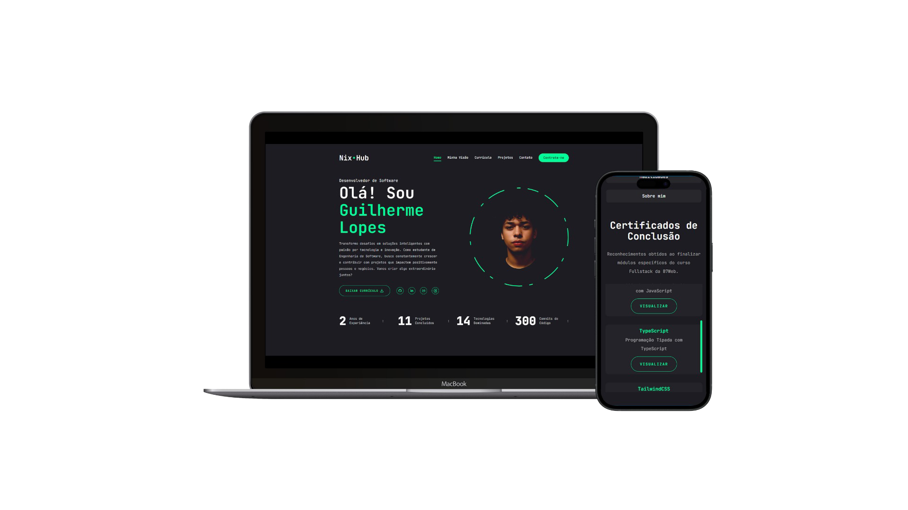

# ABANDONED
This project will not receive any further updates or maintenance.

---
# NixHub 🌟

## Overview 📖

**NixHub** is a personal website designed to showcase my professional information and projects. It serves as a hub for displaying my portfolio, skills, and the work I am passionate about.

Built with cutting-edge technologies, **NixHub** offers a modern and responsive design, ensuring smooth navigation and an engaging user experience.

### Tech Stack 🚀

This project was developed using the following technologies:

- **React**: For building the interactive user interface.
- **Next.js**: To provide a fast, server-side rendered experience.
- **Tailwind CSS**: For crafting a sleek and responsive design.

## Features ✨

- **Professional Overview**: Displays detailed information about my career and expertise.
- **Project Showcases**: Highlights projects with descriptions, technologies used, and live links.
- **Responsive Design**: Optimized for viewing on devices of all sizes.
- **User-Friendly Navigation**: Intuitive interface for seamless browsing.

## Live Demo 🌍

Explore **NixHub** live at:

[Visit NixHub](https://nixhub-portfolio.vercel.app)

## Future Plans 🛠️

- Add a blog section to share updates on new projects, programming tips, and relevant development insights.

Thank you for visiting **NixHub**! If you have any feedback or suggestions, feel free to reach out. 🚀
